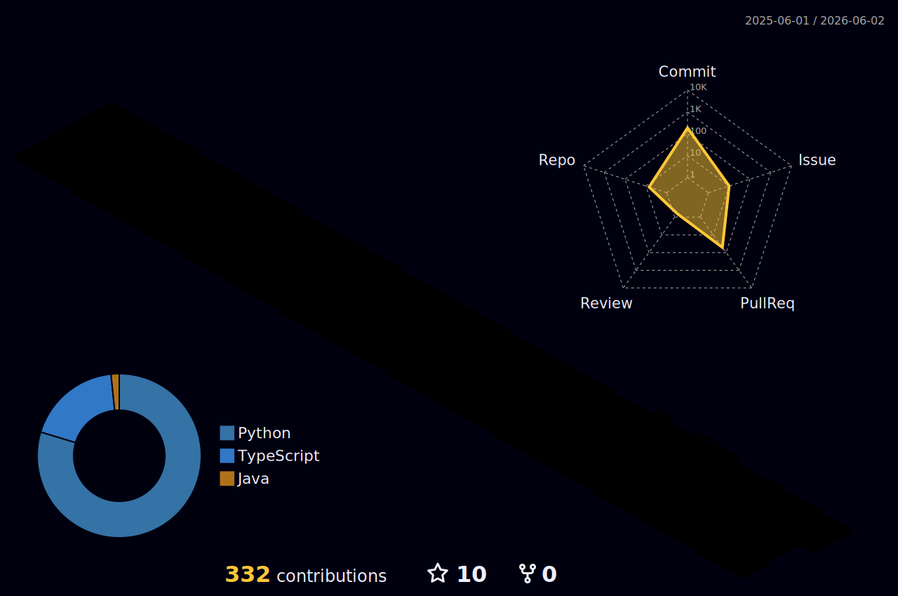

<!--

    ███╗   ███╗ █████╗ ██████╗ ██╗    ██╗ █████╗ ██╗   ██╗███████╗
    ████╗ ████║██╔══██╗██╔══██╗██║    ██║██╔══██╗╚██╗ ██╔╝██╔════╝
    ██╔████╔██║███████║██████╔╝██║ █╗ ██║███████║ ╚████╔╝ ███████╗
    ██║╚██╔╝██║██╔══██║██╔══██╗██║███╗██║██╔══██║  ╚██╔╝  ╚════██║
    ██║ ╚═╝ ██║██║  ██║██║  ██║╚███╔███╔╝██║  ██║   ██║   ███████║
    ╚═╝     ╚═╝╚═╝  ╚═╝╚═╝  ╚═╝ ╚══╝╚══╝ ╚═╝  ╚═╝   ╚═╝   ╚══════╝

-->

<!-- ═══════════════════ HEADER ═══════════════════ -->

<div align="center">
  
</div>

<!-- Animated Badges -->
<p align="center">
  <a href="https://github.com/Marways7?tab=followers"></a>&nbsp;
  <a href="https://github.com/Marways7?tab=stars"></a>&nbsp;
  <a href="https://space.bilibili.com/604578545"></a>&nbsp;
  
</p>

<!-- Typing SVG -->
<p align="center">
  <a href="https://github.com/Marways7">
    
  </a>
</p>

<br/>

<!-- ═══════════════════ ANIMATED DIVIDER ═══════════════════ -->


<!-- ═══════════════════ ABOUT ME ═══════════════════ -->

<h2 align="center">
  
  &nbsp;About Me&nbsp;
  
</h2>

<p align="center">
  
</p>

<br/>

<div align="center">
<table>
<tr>
<td width="50%" valign="top">

<h3 align="center">
  
  What I'm Up To
</h3>

```yaml
🔭 Current Focus:
   - Building AI × MCP desktop automation tools
   - Exploring Deep Learning for biomedical signals

🏥 Healthcare AI:
   - AiliaoX — Intelligent medical systems

📱 Cross-Platform:
   - Intelligent app development

📺 Content Creator:
   - B站 · Marways的AI创意屋
```

</td>
<td width="50%" valign="top">

<h3 align="center">
  
  Quick Facts
</h3>

```yaml
💡 Philosophy:
   Wild ideas → Production software with AI

🌌 Journey:
   Vibe Coder since 2023, building non-stop

🎨 Design Principles:
   Clean × Futuristic × Functional

🛠️ Specialty:
   AI agents that operate desktops via MCP

⭐ Motto:
   Open source everything!
```

</td>
</tr>
</table>
</div>

<!-- Weekly Coding Breakdown -->
<br/>

<div align="center">
<table>
<tr>
<td>

```text
🕐 Weekly Development Breakdown

AI & Agents       ██████████████░░░░░░░   65.2%
Frontend (React)   ████░░░░░░░░░░░░░░░░░   15.8%
Backend (Python)   ███░░░░░░░░░░░░░░░░░░   10.5%
Documentation      ██░░░░░░░░░░░░░░░░░░░    5.3%
DevOps / CI-CD     █░░░░░░░░░░░░░░░░░░░░    3.2%
```

</td>
</tr>
</table>
</div>

<br/>

<!-- ═══════════════════ ANIMATED DIVIDER ═══════════════════ -->


<!-- ═══════════════════ TECH STACK ═══════════════════ -->

<h2 align="center">
  
  &nbsp;Tech Arsenal&nbsp;
  
</h2>

<p align="center"><i>Technologies I love working with</i></p>

<br/>

<div align="center">

<!-- Languages -->
<h4>💻 Languages</h4>
<p>
  
  
  
  
  
  
  
  
</p>

<!-- Frameworks -->
<h4>🧰 Frameworks & Libraries</h4>
<p>
  
  
  
  
  
  
</p>

<!-- AI -->
<h4>🤖 AI & Machine Learning</h4>
<p>
  
  
  
  
  
  
</p>

<!-- Databases & Cloud -->
<h4>🗄️ Databases & Cloud</h4>
<p>
  
  
  
  
  
  
</p>

<!-- Dev Tools -->
<h4>⚙️ Dev Tools</h4>
<p>
  
  
  
  
  
  
  
  
</p>

</div>

<br/>

<!-- Skill Icons (visual summary) -->
<p align="center">
  <a href="https://skillicons.dev">
    
  </a>
</p>

<br/>

<!-- ═══════════════════ ANIMATED DIVIDER ═══════════════════ -->


<!-- ═══════════════════ GITHUB STATS ═══════════════════ -->

<h2 align="center">
  
  &nbsp;GitHub Analytics&nbsp;
  
</h2>

<br/>

<!-- Stats + Languages side by side -->
<div align="center">
  <picture>
    <source media="(prefers-color-scheme: dark)" srcset="https://github-readme-stats.vercel.app/api?username=Marways7&show_icons=true&theme=tokyonight&hide_border=true&bg_color=0D1117&title_color=A78BFA&icon_color=67E8F9&text_color=C9D1D9&ring_color=A78BFA&include_all_commits=true&count_private=true"/>
    <source media="(prefers-color-scheme: light)" srcset="https://github-readme-stats.vercel.app/api?username=Marways7&show_icons=true&theme=default&hide_border=true&include_all_commits=true&count_private=true"/>
    
  </picture>
  &nbsp;&nbsp;&nbsp;
  <picture>
    <source media="(prefers-color-scheme: dark)" srcset="https://github-readme-stats.vercel.app/api/top-langs/?username=Marways7&layout=compact&theme=tokyonight&hide_border=true&bg_color=0D1117&title_color=A78BFA&text_color=C9D1D9&langs_count=8"/>
    <source media="(prefers-color-scheme: light)" srcset="https://github-readme-stats.vercel.app/api/top-langs/?username=Marways7&layout=compact&theme=default&hide_border=true&langs_count=8"/>
    
  </picture>
</div>

<br/>

<!-- Streak Stats -->
<p align="center">
  <picture>
    <source media="(prefers-color-scheme: dark)" srcset="https://streak-stats.demolab.com?user=Marways7&theme=tokyonight_duo&hide_border=true&background=0D1117&ring=A78BFA&fire=67E8F9&currStreakLabel=A78BFA&sideLabels=C9D1D9&currStreakNum=C9D1D9&sideNums=C9D1D9&dates=555555"/>
    <source media="(prefers-color-scheme: light)" srcset="https://streak-stats.demolab.com?user=Marways7&theme=default&hide_border=true"/>
    
  </picture>
</p>

<br/>

<!-- GitHub Trophies -->
<p align="center">
  <picture>
    <source media="(prefers-color-scheme: dark)" srcset="https://github-profile-trophy.vercel.app/?username=Marways7&theme=algolia&no-frame=true&no-bg=true&column=7&margin-w=10"/>
    <source media="(prefers-color-scheme: light)" srcset="https://github-profile-trophy.vercel.app/?username=Marways7&theme=flat&no-frame=true&no-bg=true&column=7&margin-w=10"/>
    
  </picture>
</p>

<br/>

<!-- Profile Summary Cards -->
<p align="center">
  <a href="https://github.com/Marways7">
    <picture>
      <source media="(prefers-color-scheme: dark)" srcset="https://raw.githubusercontent.com/Marways7/Marways7/main/profile-summary-card-output/tokyonight/0-profile-details.svg"/>
      <source media="(prefers-color-scheme: light)" srcset="https://raw.githubusercontent.com/Marways7/Marways7/main/profile-summary-card-output/default/0-profile-details.svg"/>
      
    </picture>
  </a>
</p>

<div align="center">
  <a href="https://github.com/Marways7">
    <picture>
      <source media="(prefers-color-scheme: dark)" srcset="https://raw.githubusercontent.com/Marways7/Marways7/main/profile-summary-card-output/tokyonight/1-repos-per-language.svg"/>
      <source media="(prefers-color-scheme: light)" srcset="https://raw.githubusercontent.com/Marways7/Marways7/main/profile-summary-card-output/default/1-repos-per-language.svg"/>
      
    </picture>
  </a>
  <a href="https://github.com/Marways7">
    <picture>
      <source media="(prefers-color-scheme: dark)" srcset="https://raw.githubusercontent.com/Marways7/Marways7/main/profile-summary-card-output/tokyonight/2-most-commit-language.svg"/>
      <source media="(prefers-color-scheme: light)" srcset="https://raw.githubusercontent.com/Marways7/Marways7/main/profile-summary-card-output/default/2-most-commit-language.svg"/>
      
    </picture>
  </a>
  <a href="https://github.com/Marways7">
    <picture>
      <source media="(prefers-color-scheme: dark)" srcset="https://raw.githubusercontent.com/Marways7/Marways7/main/profile-summary-card-output/tokyonight/3-stats.svg"/>
      <source media="(prefers-color-scheme: light)" srcset="https://raw.githubusercontent.com/Marways7/Marways7/main/profile-summary-card-output/default/3-stats.svg"/>
      
    </picture>
  </a>
</div>

<br/>

<!-- ═══════════════════ ANIMATED DIVIDER ═══════════════════ -->


<!-- ═══════════════════ FEATURED PROJECTS ═══════════════════ -->

<h2 align="center">
  
  &nbsp;Featured Projects&nbsp;
  
</h2>

<p align="center"><i>A curated collection of my finest creations</i></p>

<br/>

<div align="center">

<!-- Row 1 -->
<a href="https://github.com/Marways7/ECG_IdentificationX">
  
</a>&nbsp;
<a href="https://github.com/Marways7/AiliaoX">
  
</a>

<!-- Row 2 -->
<a href="https://github.com/Marways7/cua_desktop_operator_skill">
  
</a>&nbsp;
<a href="https://github.com/Marways7/DeepReadX">
  
</a>

<!-- Row 3 -->
<a href="https://github.com/Marways7/college_student_self-rescue_guide_website">
  
</a>&nbsp;
<a href="https://github.com/Marways7/cua_desktop_operator_cli_skill">
  
</a>

</div>

<br/>

<p align="center">
  <a href="https://github.com/Marways7?tab=repositories">
    
  </a>
</p>

<br/>

<!-- ═══════════════════ ANIMATED DIVIDER ═══════════════════ -->


<!-- ═══════════════════ CONTRIBUTION GRAPH ═══════════════════ -->

<h2 align="center">
  
  &nbsp;Contribution Activity&nbsp;
  
</h2>

<br/>

<!-- Activity Graph -->
<p align="center">
  <picture>
    <source media="(prefers-color-scheme: dark)" srcset="https://github-readme-activity-graph.vercel.app/graph?username=Marways7&bg_color=0D1117&color=A78BFA&line=67E8F9&point=FFFFFF&area_color=8B5CF6&area=true&hide_border=true&custom_title=Contribution%20Graph"/>
    <source media="(prefers-color-scheme: light)" srcset="https://github-readme-activity-graph.vercel.app/graph?username=Marways7&bg_color=FFFFFF&color=6366F1&line=06B6D4&point=7C3AED&area_color=818CF8&area=true&hide_border=true&custom_title=Contribution%20Graph"/>
    
  </picture>
</p>

<!-- 3D Contribution Graph -->
<p align="center">
  <picture>
    <source media="(prefers-color-scheme: dark)" srcset="./profile-3d-contrib/profile-night-rainbow.svg"/>
    <source media="(prefers-color-scheme: light)" srcset="./profile-3d-contrib/profile-south-season-animate.svg"/>
    
  </picture>
</p>

<!-- Snake Animation -->
<div align="center">
  <picture>
    <source media="(prefers-color-scheme: dark)" srcset="https://raw.githubusercontent.com/Marways7/Marways7/output/github-snake-dark.svg" />
    <source media="(prefers-color-scheme: light)" srcset="https://raw.githubusercontent.com/Marways7/Marways7/output/github-snake.svg" />
    
  </picture>
</div>

<br/>

<!-- ═══════════════════ ANIMATED DIVIDER ═══════════════════ -->


<!-- ═══════════════════ QUOTE ═══════════════════ -->

<h2 align="center">
  
  &nbsp;Dev Quote&nbsp;
  
</h2>

<br/>

<p align="center">
  
</p>

<br/>

<!-- ═══════════════════ CONNECT ═══════════════════ -->

<h2 align="center">
  
  &nbsp;Connect With Me&nbsp;
  
</h2>

<br/>

<p align="center">
  <a href="https://github.com/Marways7"></a>&nbsp;&nbsp;
  <a href="https://space.bilibili.com/604578545"></a>
</p>

<br/>

<!-- ═══════════════════ FOOTER ═══════════════════ -->

<div align="center">
  
</div>

<p align="center">
  
</p>

<!--
  ╔══════════════════════════════════════════════╗
  ║  Made with 💜 and ☕  |  github.com/Marways7  ║
  ╚══════════════════════════════════════════════╝
-->
