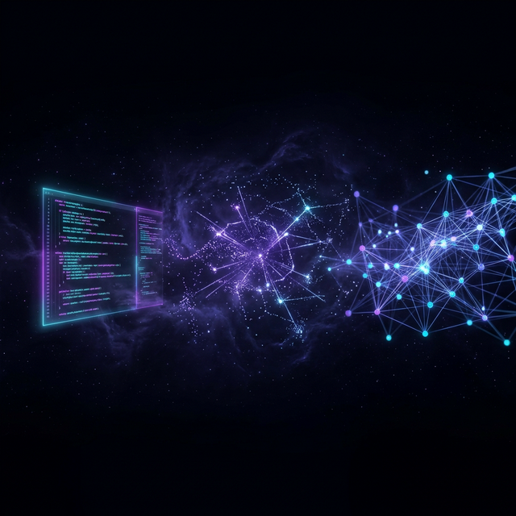
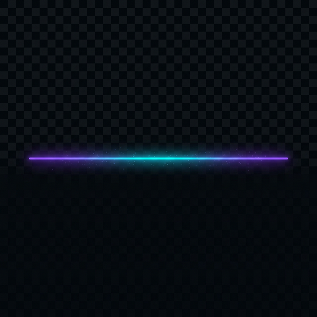

<!-- 

    ███╗   ███╗ █████╗ ██████╗ ██╗    ██╗ █████╗ ██╗   ██╗███████╗
    ████╗ ████║██╔══██╗██╔══██╗██║    ██║██╔══██╗╚██╗ ██╔╝██╔════╝
    ██╔████╔██║███████║██████╔╝██║ █╗ ██║███████║ ╚████╔╝ ███████╗
    ██║╚██╔╝██║██╔══██║██╔══██╗██║███╗██║██╔══██║  ╚██╔╝  ╚════██║
    ██║ ╚═╝ ██║██║  ██║██║  ██║╚███╔███╔╝██║  ██║   ██║   ███████║
    ╚═╝     ╚═╝╚═╝  ╚═╝╚═╝  ╚═╝ ╚══╝╚══╝ ╚═╝  ╚═╝   ╚═╝   ╚══════╝

-->

<!-- ═══════════════════════ CUSTOM BANNER ═══════════════════════ -->

<div align="center">
  
</div>

<!-- ═══════════════════════ ANIMATED HEADER ═══════════════════════ -->

<div align="center">
  
</div>

<!-- ═══════════════════════ BADGES ROW ═══════════════════════ -->

<div align="center">

  <a href="https://github.com/Marways7?tab=followers"></a>
  <a href="https://github.com/Marways7?tab=stars"></a>
  <a href="https://space.bilibili.com/604578545"></a>
  

</div>

<br/>

<!-- ═══════════════════════ TYPING ANIMATION ═══════════════════════ -->

<div align="center">
  <a href="https://github.com/Marways7">
    
  </a>
</div>

<br/>

<!-- ═══════════════════════ DIVIDER ═══════════════════════ -->
<div align="center"></div>
<br/>

<!-- ═══════════════════════ ABOUT ME ═══════════════════════ -->

<h2 align="center">
  
  &nbsp;<samp>About.me</samp>
</h2>

<div align="center">

```javascript
// 🧬 marways.config.js

const Marways = {
    identity:     "🌌 Vibe Coder  |  🧪 AI Alchemist",
    codingSince:  2023,
    code:         ["Python", "TypeScript", "Java", "JavaScript", "MATLAB"],
    askMeAbout:   ["AI/ML", "MCP", "Full-Stack", "Signal Processing", "Healthcare IT"],
    technologies: {
        ai:        ["PyTorch", "TensorFlow", "OpenCV", "DeepSeek"],
        frontend:  ["React", "Next.js", "Tailwind CSS"],
        backend:   ["Node.js", "Flask", "Express"],
        mobile:    ["Android (Java)"],
        database:  ["MongoDB", "MySQL", "Redis"],
        devops:    ["Docker", "GitHub Actions", "Vercel"],
        protocol:  ["MCP (Model Context Protocol)"]
    },
    currentFocus: "Building AI-powered tools that make the impossible possible",
    motto:        "const magic = (wildIdea) => AI.transform(wildIdea).intoReality()"
};
```

</div>

<br/>

<div align="center">
<table>
<tr>
<td width="50%" valign="top">

<h3 align="center">🎯 What I'm Up To</h3>

&nbsp;

- 🔭 Building **AI × MCP** tools for desktop automation
- 🧠 Exploring **Deep Learning** for biomedical signals
- 🏥 Creating **Healthcare AI** systems
- 📱 Cross-platform intelligent app development
- 📺 Sharing on [**B站 · Marways的AI创意屋**](https://space.bilibili.com/604578545)

</td>
<td width="50%" valign="top">

<h3 align="center">⚡ Quick Facts</h3>

&nbsp;

- 💡 **wild ideas** → **production software** with AI
- 🌌 Vibe Coder since 2023, building non-stop
- 🎨 Design: **clean × futuristic × functional**
- 🛠️ AI agents that **operate desktops** (MCP)
- ⭐ Open source everything — **Star if inspired!**

</td>
</tr>
</table>
</div>

<br/>

<!-- ═══════════════════════ DIVIDER ═══════════════════════ -->
<div align="center"></div>
<br/>

<!-- ═══════════════════════ TECH STACK ═══════════════════════ -->

<h2 align="center">
  <samp>🛠️ Tech.stack()</samp>
</h2>

<br/>

<div align="center">

<!-- Languages -->
<h4>💻 Languages</h4>
<p>
  <a href="https://skillicons.dev">
    
  </a>
</p>

<!-- Frameworks & Libraries -->
<h4>🧰 Frameworks & Libraries</h4>
<p>
  <a href="https://skillicons.dev">
    
  </a>
</p>

<!-- AI & Machine Learning -->
<h4>🤖 AI & Machine Learning</h4>
<p>
  <a href="https://skillicons.dev">
    
  </a>
</p>

<!-- Databases & Infrastructure -->
<h4>🗄️ Databases & Cloud</h4>
<p>
  <a href="https://skillicons.dev">
    
  </a>
</p>

<!-- Dev Tools -->
<h4>⚙️ Dev Tools</h4>
<p>
  <a href="https://skillicons.dev">
    
  </a>
</p>

</div>

<br/>

<!-- ═══════════════════════ DIVIDER ═══════════════════════ -->
<div align="center"></div>
<br/>

<!-- ═══════════════════════ STATS DASHBOARD ═══════════════════════ -->

<h2 align="center">
  <samp>📊 Stats.dashboard()</samp>
</h2>

<br/>

<div align="center">
  
  &nbsp;&nbsp;&nbsp;
  
</div>

<br/>

<div align="center">
  
</div>

<br/>

<!-- ═══════════════════════ DIVIDER ═══════════════════════ -->
<div align="center"></div>
<br/>

<!-- ═══════════════════════ FEATURED PROJECTS ═══════════════════════ -->

<h2 align="center">
  <samp>🚀 Featured.projects()</samp>
</h2>
<p align="center"><samp>A curated collection of my finest creations</samp></p>

<br/>

<div align="center">

<!-- Row 1 -->
<a href="https://github.com/Marways7/ECG_IdentificationX">
  
</a>
&nbsp;
<a href="https://github.com/Marways7/AiliaoX">
  
</a>

<br/><br/>

<!-- Row 2 -->
<a href="https://github.com/Marways7/cua_desktop_operator_skill">
  
</a>
&nbsp;
<a href="https://github.com/Marways7/DeepReadX">
  
</a>

<br/><br/>

<!-- Row 3 -->
<a href="https://github.com/Marways7/college_student_self-rescue_guide_website">
  
</a>
&nbsp;
<a href="https://github.com/Marways7/cua_desktop_operator_cli_skill">
  
</a>

</div>

<br/>

<!-- ═══════════════════════ DIVIDER ═══════════════════════ -->
<div align="center"></div>
<br/>

<!-- ═══════════════════════ CONTRIBUTION GRAPH ═══════════════════════ -->

<h2 align="center">
  <samp>📈 Contributions.visualize()</samp>
</h2>

<br/>

<div align="center">
  
</div>

<br/>

<!-- Snake Animation -->
<div align="center">
  <picture>
    <source media="(prefers-color-scheme: dark)" srcset="https://raw.githubusercontent.com/Marways7/Marways7/output/github-snake-dark.svg" />
    <source media="(prefers-color-scheme: light)" srcset="https://raw.githubusercontent.com/Marways7/Marways7/output/github-snake.svg" />
    
  </picture>
</div>

<br/>

<!-- ═══════════════════════ DIVIDER ═══════════════════════ -->
<div align="center"></div>
<br/>

<!-- ═══════════════════════ TROPHIES ═══════════════════════ -->

<h2 align="center">
  <samp>🏆 Achievements.unlock()</samp>
</h2>

<br/>

<div align="center">
  
</div>

<br/>

<!-- ═══════════════════════ DIVIDER ═══════════════════════ -->
<div align="center"></div>
<br/>

<!-- ═══════════════════════ QUOTE ═══════════════════════ -->

<h2 align="center">
  <samp>💭 Random.devQuote()</samp>
</h2>

<br/>

<div align="center">
  
</div>

<br/>

<!-- ═══════════════════════ CONNECT ═══════════════════════ -->

<h2 align="center">
  <samp>🤝 Connect.with(me)</samp>
</h2>

<br/>

<div align="center">
  <a href="https://github.com/Marways7">
    
  </a>
  &nbsp;
  <a href="https://space.bilibili.com/604578545">
    
  </a>
</div>

<br/>

<!-- ═══════════════════════ FOOTER ═══════════════════════ -->

<div align="center">
  
</div>

<div align="center">
  <br/>
  
  <br/><br/>
</div>

<!-- 

  ╔══════════════════════════════════════════════════════╗
  ║                                                      ║
  ║          Made with 💜 and a lot of ☕               ║
  ║          github.com/Marways7                         ║
  ║                                                      ║
  ╚══════════════════════════════════════════════════════╝

-->
