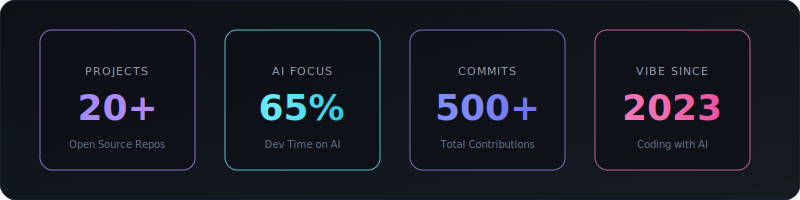

<!--

    ███╗   ███╗ █████╗ ██████╗ ██╗    ██╗ █████╗ ██╗   ██╗███████╗███████╗
    ████╗ ████║██╔══██╗██╔══██╗██║    ██║██╔══██╗╚██╗ ██╔╝██╔════╝╚════██║
    ██╔████╔██║███████║██████╔╝██║ █╗ ██║███████║ ╚████╔╝ ███████╗    ██╔╝
    ██║╚██╔╝██║██╔══██║██╔══██╗██║███╗██║██╔══██║  ╚██╔╝  ╚════██║   ██╔╝
    ██║ ╚═╝ ██║██║  ██║██║  ██║╚███╔███╔╝██║  ██║   ██║   ███████║   ██║
    ╚═╝     ╚═╝╚═╝  ╚═╝╚═╝  ╚═╝ ╚══╝╚══╝ ╚═╝  ╚═╝   ╚═╝   ╚══════╝   ╚═╝

    ⚡ Welcome to my digital universe — where AI meets wild imagination ⚡

-->

<!-- ╔══════════════════════════════════════════════════════════════╗ -->
<!-- ║                     ANIMATED HEADER                         ║ -->
<!-- ╚══════════════════════════════════════════════════════════════╝ -->

<div align="center">
  <a href="https://github.com/Marways7">
    
  </a>
</div>

<!-- Status Badges -->
<p align="center">
  <a href="https://github.com/Marways7?tab=followers"></a>&nbsp;
  <a href="https://github.com/Marways7?tab=stars"></a>&nbsp;
  <a href="https://space.bilibili.com/604578545"></a>&nbsp;
  
</p>

<!-- Dynamic Typing -->
<p align="center">
  <a href="https://github.com/Marways7">
    
  </a>
</p>

<br/>

<!-- ═══════════════════ NEON DIVIDER ═══════════════════ -->
<p align="center"></p>

<!-- ╔══════════════════════════════════════════════════════════════╗ -->
<!-- ║                      QUICK METRICS                          ║ -->
<!-- ╚══════════════════════════════════════════════════════════════╝ -->

<p align="center">
  
</p>

<br/>

<!-- ═══════════════════ NEON DIVIDER ═══════════════════ -->
<p align="center"></p>

<!-- ╔══════════════════════════════════════════════════════════════╗ -->
<!-- ║                       ABOUT ME                              ║ -->
<!-- ╚══════════════════════════════════════════════════════════════╝ -->

<h2 align="center">
  
  &nbsp;关于我 · About Me&nbsp;
  
</h2>

<p align="center">
  
</p>

<br/>

<div align="center">
<table>
<tr>
<td width="50%" valign="top">

<h3 align="center">
  
  当前状态
</h3>

```yaml
🔭 Current Focus:
   ├── AI × MCP Desktop Automation Tools
   ├── Deep Learning for Biomedical Signals
   └── Building Intelligent Agent Systems

🏥 Healthcare AI:
   └── AiliaoX — Intelligent Medical Systems

📱 Cross-Platform:
   └── AI-Powered App Development

📺 Content Creator:
   └── B站 · Marways的AI创意屋
```

</td>
<td width="50%" valign="top">

<h3 align="center">
  
  关于我
</h3>

```yaml
💡 Philosophy:
   Wild ideas → Production software with AI

🌌 Identity:
   Vibe Coder since 2023, never stop building

🎨 Aesthetic:
   Cyberpunk × Minimalist × Functional

🛠️ Specialty:
   AI agents that automate everything via MCP

🔮 Vision:
   AI × Human Creativity = Infinite Possibilities

⭐ Principle:
   Open source everything!
```

</td>
</tr>
</table>
</div>

<br/>

<div align="center">
<table>
<tr>
<td>

```text
📊 Weekly Development Breakdown

AI & Agents        ████████████████░░░░░░░░░   65.2%
Frontend (React)   ████░░░░░░░░░░░░░░░░░░░░░   15.8%
Backend (Python)   ██▓░░░░░░░░░░░░░░░░░░░░░░   10.5%
Documentation      ██░░░░░░░░░░░░░░░░░░░░░░░    5.3%
DevOps / CI-CD     █░░░░░░░░░░░░░░░░░░░░░░░░    3.2%
```

</td>
</tr>
</table>
</div>

<br/>

<!-- ═══════════════════ NEON DIVIDER ═══════════════════ -->
<p align="center"></p>

<!-- ╔══════════════════════════════════════════════════════════════╗ -->
<!-- ║                      TECH STACK                             ║ -->
<!-- ╚══════════════════════════════════════════════════════════════╝ -->

<h2 align="center">
  
  &nbsp;技术栈 · Tech Arsenal&nbsp;
  
</h2>

<p align="center">
  
</p>

<br/>

<!-- Skill Icons Visual Grid -->
<div align="center">
  <a href="https://skillicons.dev">
    
  </a>
  <br/><br/>
  <a href="https://skillicons.dev">
    
  </a>
  <br/><br/>
  <a href="https://skillicons.dev">
    
  </a>
</div>

<br/>

<!-- Detailed Badge Grid -->
<div align="center">

<details>
<summary><b>🤖 AI & Machine Learning — Click to expand</b></summary>
<br/>
<p>
  
  
  
  
  
  
  
  
</p>
</details>

<details>
<summary><b>💻 Languages & Frameworks — Click to expand</b></summary>
<br/>
<p>
  
  
  
  
  
  
  
  
  
  
  
</p>
</details>

<details>
<summary><b>☁️ Infrastructure & Tools — Click to expand</b></summary>
<br/>
<p>
  
  
  
  
  
  
  
  
  
  
  
  
</p>
</details>

</div>

<br/>

<!-- ═══════════════════ NEON DIVIDER ═══════════════════ -->
<p align="center"></p>

<!-- ╔══════════════════════════════════════════════════════════════╗ -->
<!-- ║                     GITHUB ANALYTICS                        ║ -->
<!-- ╚══════════════════════════════════════════════════════════════╝ -->

<h2 align="center">
  
  &nbsp;数据面板 · GitHub Analytics&nbsp;
  
</h2>

<br/>

<!-- Stats + Languages -->
<div align="center">
  <picture>
    <source media="(prefers-color-scheme: dark)" srcset="https://github-readme-stats.vercel.app/api?username=Marways7&show_icons=true&theme=tokyonight&hide_border=true&bg_color=0D1117&title_color=A78BFA&icon_color=67E8F9&text_color=C9D1D9&ring_color=A78BFA&include_all_commits=true&count_private=true&rank_icon=github"/>
    <source media="(prefers-color-scheme: light)" srcset="https://github-readme-stats.vercel.app/api?username=Marways7&show_icons=true&theme=default&hide_border=true&include_all_commits=true&count_private=true&rank_icon=github"/>
    
  </picture>
  &nbsp;&nbsp;
  <picture>
    <source media="(prefers-color-scheme: dark)" srcset="https://github-readme-stats.vercel.app/api/top-langs/?username=Marways7&layout=compact&theme=tokyonight&hide_border=true&bg_color=0D1117&title_color=A78BFA&text_color=C9D1D9&langs_count=10"/>
    <source media="(prefers-color-scheme: light)" srcset="https://github-readme-stats.vercel.app/api/top-langs/?username=Marways7&layout=compact&theme=default&hide_border=true&langs_count=10"/>
    
  </picture>
</div>

<br/>

<!-- Streak -->
<p align="center">
  <picture>
    <source media="(prefers-color-scheme: dark)" srcset="https://streak-stats.demolab.com?user=Marways7&theme=tokyonight_duo&hide_border=true&background=0D1117&ring=A78BFA&fire=67E8F9&currStreakLabel=A78BFA&sideLabels=C9D1D9&currStreakNum=C9D1D9&sideNums=C9D1D9&dates=555555"/>
    <source media="(prefers-color-scheme: light)" srcset="https://streak-stats.demolab.com?user=Marways7&theme=default&hide_border=true"/>
    
  </picture>
</p>

<br/>

<!-- Trophies -->
<p align="center">
  <picture>
    <source media="(prefers-color-scheme: dark)" srcset="https://github-profile-trophy.vercel.app/?username=Marways7&theme=algolia&no-frame=true&no-bg=true&column=7&margin-w=10"/>
    <source media="(prefers-color-scheme: light)" srcset="https://github-profile-trophy.vercel.app/?username=Marways7&theme=flat&no-frame=true&no-bg=true&column=7&margin-w=10"/>
    
  </picture>
</p>

<br/>

<!-- Profile Summary Cards -->
<p align="center">
  <a href="https://github.com/Marways7">
    <picture>
      <source media="(prefers-color-scheme: dark)" srcset="https://raw.githubusercontent.com/Marways7/Marways7/main/profile-summary-card-output/tokyonight/0-profile-details.svg"/>
      <source media="(prefers-color-scheme: light)" srcset="https://raw.githubusercontent.com/Marways7/Marways7/main/profile-summary-card-output/default/0-profile-details.svg"/>
      
    </picture>
  </a>
</p>

<div align="center">
  <a href="https://github.com/Marways7">
    <picture>
      <source media="(prefers-color-scheme: dark)" srcset="https://raw.githubusercontent.com/Marways7/Marways7/main/profile-summary-card-output/tokyonight/1-repos-per-language.svg"/>
      <source media="(prefers-color-scheme: light)" srcset="https://raw.githubusercontent.com/Marways7/Marways7/main/profile-summary-card-output/default/1-repos-per-language.svg"/>
      
    </picture>
  </a>
  <a href="https://github.com/Marways7">
    <picture>
      <source media="(prefers-color-scheme: dark)" srcset="https://raw.githubusercontent.com/Marways7/Marways7/main/profile-summary-card-output/tokyonight/2-most-commit-language.svg"/>
      <source media="(prefers-color-scheme: light)" srcset="https://raw.githubusercontent.com/Marways7/Marways7/main/profile-summary-card-output/default/2-most-commit-language.svg"/>
      
    </picture>
  </a>
  <a href="https://github.com/Marways7">
    <picture>
      <source media="(prefers-color-scheme: dark)" srcset="https://raw.githubusercontent.com/Marways7/Marways7/main/profile-summary-card-output/tokyonight/3-stats.svg"/>
      <source media="(prefers-color-scheme: light)" srcset="https://raw.githubusercontent.com/Marways7/Marways7/main/profile-summary-card-output/default/3-stats.svg"/>
      
    </picture>
  </a>
</div>

<br/>

<!-- ═══════════════════ NEON DIVIDER ═══════════════════ -->
<p align="center"></p>

<!-- ╔══════════════════════════════════════════════════════════════╗ -->
<!-- ║                    FEATURED PROJECTS                        ║ -->
<!-- ╚══════════════════════════════════════════════════════════════╝ -->

<h2 align="center">
  
  &nbsp;开源项目 · Featured Projects&nbsp;
  
</h2>

<p align="center">
  
</p>

<br/>

<div align="center">

<!-- Row 1 -->
<a href="https://github.com/Marways7/ECG_IdentificationX">
  
</a>&nbsp;
<a href="https://github.com/Marways7/AiliaoX">
  
</a>

<!-- Row 2 -->
<a href="https://github.com/Marways7/cua_desktop_operator_skill">
  
</a>&nbsp;
<a href="https://github.com/Marways7/DeepReadX">
  
</a>

<!-- Row 3 -->
<a href="https://github.com/Marways7/college_student_self-rescue_guide_website">
  
</a>&nbsp;
<a href="https://github.com/Marways7/cua_desktop_operator_cli_skill">
  
</a>

</div>

<br/>

<p align="center">
  <a href="https://github.com/Marways7?tab=repositories">
    
  </a>
</p>

<br/>

<!-- ═══════════════════ NEON DIVIDER ═══════════════════ -->
<p align="center"></p>

<!-- ╔══════════════════════════════════════════════════════════════╗ -->
<!-- ║                  CONTRIBUTION ACTIVITY                      ║ -->
<!-- ╚══════════════════════════════════════════════════════════════╝ -->

<h2 align="center">
  
  &nbsp;贡献活动 · Contribution Activity&nbsp;
  
</h2>

<br/>

<!-- Activity Graph -->
<p align="center">
  <picture>
    <source media="(prefers-color-scheme: dark)" srcset="https://github-readme-activity-graph.vercel.app/graph?username=Marways7&bg_color=0D1117&color=A78BFA&line=67E8F9&point=FFFFFF&area_color=8B5CF6&area=true&hide_border=true&custom_title=Contribution%20Timeline"/>
    <source media="(prefers-color-scheme: light)" srcset="https://github-readme-activity-graph.vercel.app/graph?username=Marways7&bg_color=FFFFFF&color=6366F1&line=06B6D4&point=7C3AED&area_color=818CF8&area=true&hide_border=true&custom_title=Contribution%20Timeline"/>
    
  </picture>
</p>

<!-- 3D Contribution -->
<p align="center">
  <picture>
    <source media="(prefers-color-scheme: dark)" srcset="./profile-3d-contrib/profile-night-rainbow.svg"/>
    <source media="(prefers-color-scheme: light)" srcset="./profile-3d-contrib/profile-south-season-animate.svg"/>
    
  </picture>
</p>

<!-- Snake -->
<div align="center">
  <picture>
    <source media="(prefers-color-scheme: dark)" srcset="https://raw.githubusercontent.com/Marways7/Marways7/output/github-snake-dark.svg"/>
    <source media="(prefers-color-scheme: light)" srcset="https://raw.githubusercontent.com/Marways7/Marways7/output/github-snake.svg"/>
    
  </picture>
</div>

<br/>

<!-- ═══════════════════ NEON DIVIDER ═══════════════════ -->
<p align="center"></p>

<!-- ╔══════════════════════════════════════════════════════════════╗ -->
<!-- ║                       DEV QUOTE                             ║ -->
<!-- ╚══════════════════════════════════════════════════════════════╝ -->

<h2 align="center">
  
  &nbsp;开发者箴言 · Dev Quote&nbsp;
  
</h2>

<br/>

<p align="center">
  
</p>

<br/>

<!-- ═══════════════════ NEON DIVIDER ═══════════════════ -->
<p align="center"></p>

<!-- ╔══════════════════════════════════════════════════════════════╗ -->
<!-- ║                       CONNECT                               ║ -->
<!-- ╚══════════════════════════════════════════════════════════════╝ -->

<h2 align="center">
  
  &nbsp;联系我 · Connect With Me&nbsp;
  
</h2>

<br/>

<p align="center">
  <a href="https://github.com/Marways7"></a>&nbsp;&nbsp;
  <a href="https://space.bilibili.com/604578545"></a>
</p>

<br/>

<!-- ╔══════════════════════════════════════════════════════════════╗ -->
<!-- ║                        FOOTER                               ║ -->
<!-- ╚══════════════════════════════════════════════════════════════╝ -->

<div align="center">
  
</div>

<p align="center">
  
</p>

<p align="center">
  
</p>

<!--
  ╔══════════════════════════════════════════════════════════════╗
  ║                                                              ║
  ║   Made with 💜 & ☕ & AI  |  github.com/Marways7             ║
  ║                                                              ║
  ║   "The best way to predict the future is to build it."       ║
  ║                                                              ║
  ╚══════════════════════════════════════════════════════════════╝
-->
