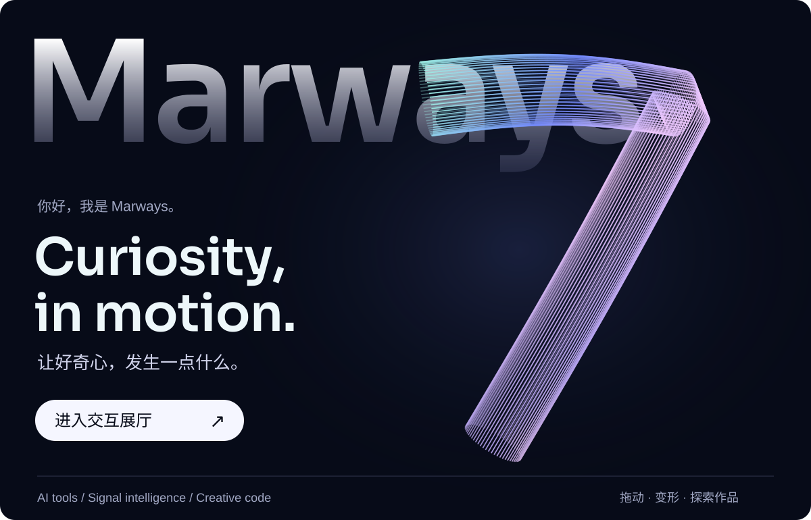
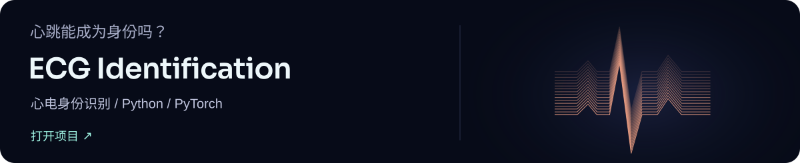
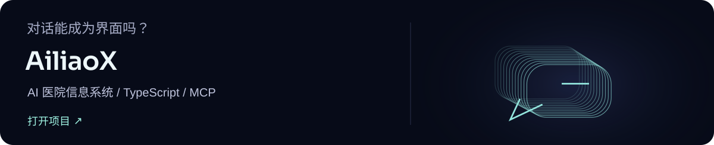
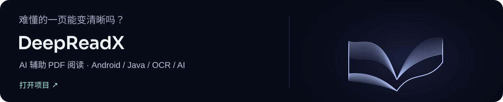
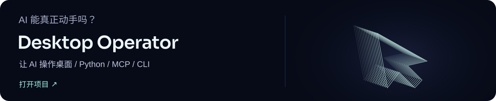
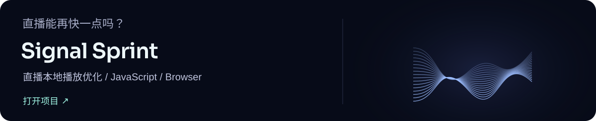

<a href="https://marways7.github.io/Marways7/">
  <picture>
    <source media="(prefers-reduced-motion: reduce) and (max-width: 640px)" srcset="./assets/shape/cinema-hero-mobile-still.svg" />
    <source media="(prefers-reduced-motion: reduce)" srcset="./assets/shape/cinema-hero-still.svg" />
    <source media="(max-width: 640px)" srcset="./assets/shape/cinema-hero-mobile.svg" />
    
  </picture>
</a>

  <b><a href="https://marways7.github.io/Marways7/">进入交互展厅 ↗</a></b> &nbsp; / &nbsp;
  <a href="#作品现场">作品现场</a> &nbsp; / &nbsp;
  <a href="https://space.bilibili.com/604578545">B站 · AI创意屋</a> &nbsp; / &nbsp;
  <a href="./docs/STATIC.md">静态阅读</a>

在交互展厅里，拖动改变视角，切换「7 / 轨道 / 信号」，或让灵感粒子散开。

 

### 一个「能不能」，就是一个开始。

你好，我是 **Marways**。我喜欢把一个奇怪的念头，做成你能亲手试试的东西。

从心电信号里的身份特征，到能讲清一页 PDF 的 AI；从自然语言驱动的信息系统，到让 AI 真正操作桌面的工具——我在探索 **AI 与现实之间，具体能发生什么**。

**想法可以跳跃，作品要落地。** 这里记录我的实验、学习和开源作品。

 

## 作品现场

每张作品图都可以点击，直接进入对应仓库。

<a href="https://github.com/Marways7/ECG_IdentificationX">
  <picture>
    <source media="(max-width: 640px)" srcset="./assets/shape/project-1-mobile.svg" />
    
  </picture>
</a>

<a href="https://github.com/Marways7/AiliaoX">
  <picture>
    <source media="(max-width: 640px)" srcset="./assets/shape/project-2-mobile.svg" />
    
  </picture>
</a>

<a href="https://github.com/Marways7/DeepReadX">
  <picture>
    <source media="(max-width: 640px)" srcset="./assets/shape/project-3-mobile.svg" />
    
  </picture>
</a>

<a href="https://github.com/Marways7/cua_desktop_operator_skill">
  <picture>
    <source media="(max-width: 640px)" srcset="./assets/shape/project-4-mobile.svg" />
    
  </picture>
</a>

<a href="https://github.com/Marways7/signal-sprint">
  <picture>
    <source media="(max-width: 640px)" srcset="./assets/shape/project-5-mobile.svg" />
    
  </picture>
</a>

<a href="https://github.com/Marways7/college_student_self-rescue_guide_website">
  <picture>
    <source media="(max-width: 640px)" srcset="./assets/shape/project-6-mobile.svg" />
    
  </picture>
</a>

<a href="https://github.com/Marways7/cua_desktop_operator_cli_skill">Desktop Operator · CLI 版</a> &nbsp; / &nbsp; <a href="https://github.com/Marways7?tab=repositories">探索全部仓库 ↗</a>

<b>展开：这些作品分别在探索什么？</b>

| 作品 | 从一个问题出发 |
| :--- | :--- |
| [ECG Identification](https://github.com/Marways7/ECG_IdentificationX) | 心跳能成为身份吗？从信号处理到轻量 CNN 的心电身份识别实验。 |
| [AiliaoX](https://github.com/Marways7/AiliaoX) | 对话能成为界面吗？通过 MCP 连接 AI 与医院信息管理。 |
| [DeepReadX](https://github.com/Marways7/DeepReadX) | 难懂的一页能变清晰吗？Android PDF 阅读、OCR 与自定义风格 AI 讲解。 |
| [Desktop Operator](https://github.com/Marways7/cua_desktop_operator_skill) | AI 能真正动手吗？面向 AI Agent 的桌面操作工具，提供 MCP 和 CLI 两种接入方式。 |
| [Signal Sprint](https://github.com/Marways7/signal-sprint) | 直播能再快一点吗？测量与优化本地播放体验。 |
| [Campus Guide](https://github.com/Marways7/college_student_self-rescue_guide_website) | 知识能找到需要它的人吗？学习资源的发现、管理与分享。 |

项目能力、运行条件与当前状态，以各仓库说明为准。

<b>展开：我用什么，把想法做出来</b>

| 探索方向 | 作品中用到的工具 |
| :--- | :--- |
| 信号与模型 | Python、PyTorch、信号处理 |
| 产品与界面 | TypeScript、JavaScript、Web、Java、Android |
| AI 与行动 | MCP、AI 服务集成、桌面自动化 |

 

<picture>
  <source media="(max-width: 640px)" srcset="./assets/shape/pulse-mobile.svg" />
  
</picture>

每日刷新公开仓库数据。Star 为各公开仓库获得的 Star 之和；语言为各仓库主要语言的去重计数。

 

### What if… 下一次灵感，来自你？

在 **[交互展厅](https://marways7.github.io/Marways7/)** 亲手探索，在 **[B站 · Marways的AI创意屋](https://space.bilibili.com/604578545)** 看创意与实践，在 **[GitHub](https://github.com/Marways7?tab=repositories)** 看代码与过程。

欢迎到相关项目交流，一起把「能不能」变成「做出来了」。

<!-- Repository-owned art. Interactive site source: site/. Build notes: docs/DESIGN.md. -->
