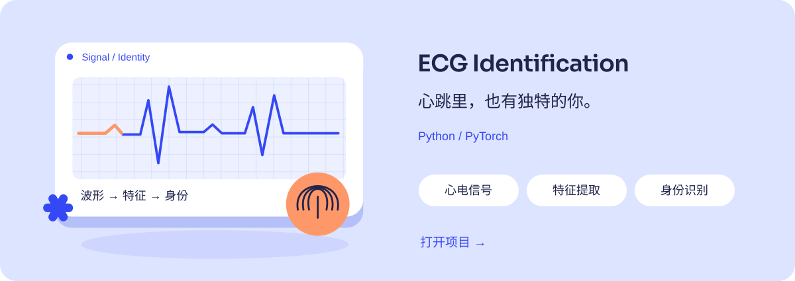
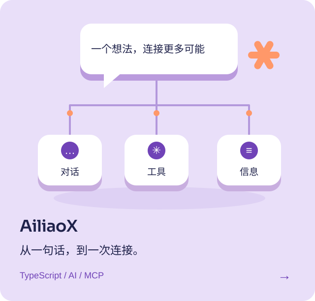
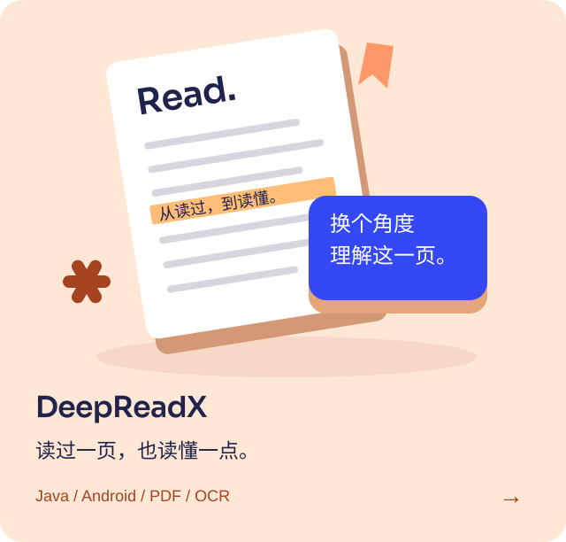
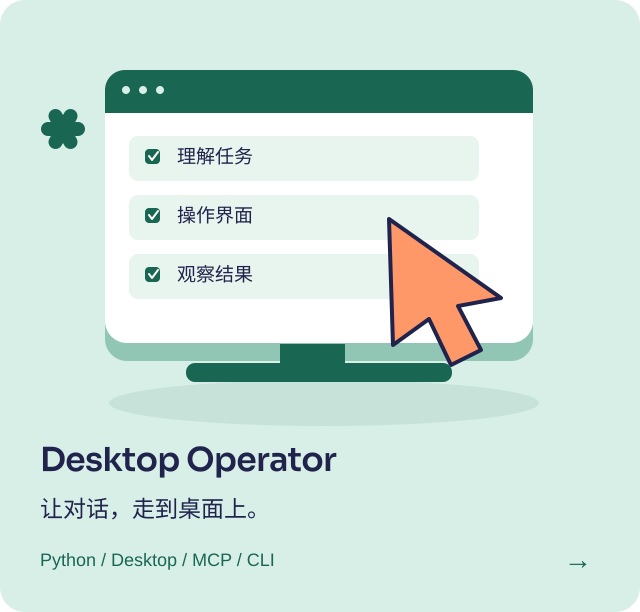
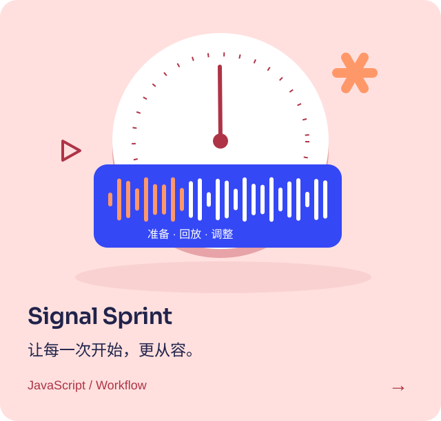
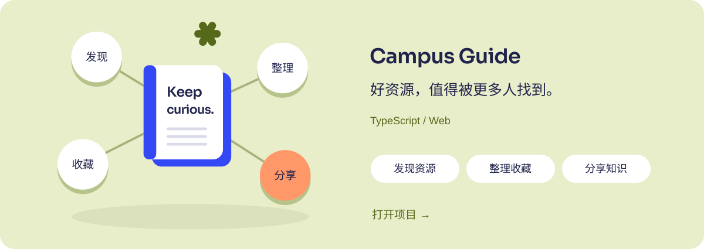
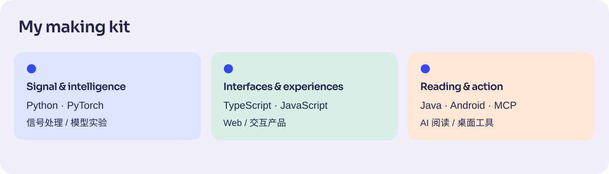

<a href="https://marways7.github.io/Marways7/">
  <picture>
    <source media="(max-width: 640px)" srcset="./assets/play/cover-mobile.jpg" />
    
  </picture>
</a>

  <b><a href="https://marways7.github.io/Marways7/">打开作品工作台</a></b> &nbsp; · &nbsp;
  <a href="#从一个问题到一个作品">探索开源作品</a> &nbsp; · &nbsp;
  <a href="https://space.bilibili.com/604578545">B站 · AI 创意屋</a> &nbsp; · &nbsp;
  <a href="./docs/STATIC.md">静态阅读</a>

<picture>
  <source media="(prefers-reduced-motion: reduce)" srcset="./assets/play/ribbon-still.svg" />
  
</picture>

### 你好，我是 Marways。

**用 AI 写代码，也用代码探索 AI。** 我喜欢把具体的问题拆开，把零散的灵感接上，做成能够被尝试、被改进的东西。

我的好奇心常常沿着三条路线出发：**从信号里发现规律，从阅读中打开理解，让 AI 走向实际的工具与交互。** 这里记录我的开源实验，也为下一个「能不能」留着位置。

 

## 从一个问题，到一个作品

### 一段心跳，能不能成为一种身份？

<a href="https://github.com/Marways7/ECG_IdentificationX">
  <picture>
    <source media="(prefers-reduced-motion: reduce) and (max-width: 640px)" srcset="./assets/play/ecg-still.svg" />
    <source media="(prefers-reduced-motion: reduce)" srcset="./assets/play/ecg-wide-still.svg" />
    <source media="(max-width: 640px)" srcset="./assets/play/ecg.svg" />
    
  </picture>
</a>

**[ECG Identification](https://github.com/Marways7/ECG_IdentificationX)** 把信号处理与轻量 CNN 结合，探索 ECG 生物特征身份识别。关注的是心电信号中的身份特征。

### 一句话、一页书，能不能多一个入口？

  <a href="https://github.com/Marways7/AiliaoX"><picture><source media="(prefers-reduced-motion: reduce)" srcset="./assets/play/ailiao-still.svg" /></picture></a>
  <a href="https://github.com/Marways7/DeepReadX"><picture><source media="(prefers-reduced-motion: reduce)" srcset="./assets/play/read-still.svg" /></picture></a>

**[AiliaoX](https://github.com/Marways7/AiliaoX)** — 通过自然语言表达意图，用 MCP 工具连接医院信息与操作，探索更直接的交互方式。

**[DeepReadX](https://github.com/Marways7/DeepReadX)** — 一个 Android AI 辅助阅读项目。把 PDF、OCR 和可自定义风格的解释放在一起，让一页文字多一种被理解的方式。

### 从「说出来」，再往「做出来」走一步。

  <a href="https://github.com/Marways7/cua_desktop_operator_skill"><picture><source media="(prefers-reduced-motion: reduce)" srcset="./assets/play/desktop-still.svg" /></picture></a>
  <a href="https://github.com/Marways7/signal-sprint"><picture><source media="(prefers-reduced-motion: reduce)" srcset="./assets/play/sprint-still.svg" /></picture></a>

**[Desktop Operator](https://github.com/Marways7/cua_desktop_operator_skill)** — 面向 AI 的桌面操作工具，探索意图、界面与行动的连接。提供 [MCP 版本](https://github.com/Marways7/cua_desktop_operator_skill) 和 [CLI 版本](https://github.com/Marways7/cua_desktop_operator_cli_skill)。

**[Signal Sprint](https://github.com/Marways7/signal-sprint)** — 从直播准备流程里的小摩擦出发，把实测和本地回放结合，改进扫码准备与启动节奏。

### 一个人找到的好资源，能不能帮助更多人？

<a href="https://github.com/Marways7/college_student_self-rescue_guide_website">
  <picture>
    <source media="(prefers-reduced-motion: reduce) and (max-width: 640px)" srcset="./assets/play/campus-still.svg" />
    <source media="(prefers-reduced-motion: reduce)" srcset="./assets/play/campus-wide-still.svg" />
    <source media="(max-width: 640px)" srcset="./assets/play/campus.svg" />
    
  </picture>
</a>

**[Campus Guide](https://github.com/Marways7/college_student_self-rescue_guide_website)** 连接学习资源的发现、管理与分享，让一个人的探索成为另一个人的起点。

以上图形是项目概念图解，具体功能、环境要求与当前进展，请以各仓库说明为准。

 

## 我的创造工具箱

<picture>
  <source media="(max-width: 640px)" srcset="./assets/play/toolkit-mobile.svg" />
  
</picture>

| 我关心的事 | 我会怎样开始 |
| :--- | :--- |
| **有没有更直接的办法？** | 先把问题说清楚，再做一个能体验的版本。 |
| **AI 能不能真正帮上忙？** | 把对话接到阅读、信号、界面与工具里。 |
| **还能不能做得更好？** | 留下代码和过程，让作品在使用与反馈中继续生长。 |

### 继续探索，或来交换一个想法。

**[互动主页](https://marways7.github.io/Marways7/)** · 在六个项目之间切换场景，试试图解里的小交互。

**[B站 · Marways的AI创意屋](https://space.bilibili.com/604578545)** · 分享 AI 创意与实践。

**[全部开源仓库](https://github.com/Marways7?tab=repositories)** · 看作品，也看实现的过程。

欢迎带来一个反馈、一个问题，或者一个新的开始。✳

公开 GitHub 数据快照

<picture><source media="(max-width: 640px)" srcset="./assets/shape/pulse-mobile.svg" /></picture>

每日刷新。Star 为公开原创仓库所获 Star 总和；语言数为这些仓库主要语言的去重计数。

<!-- Local artwork and original composition: docs/PLAYGROUND.md. Interactive website: site/. -->
