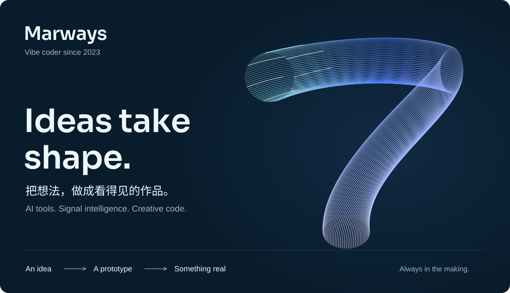
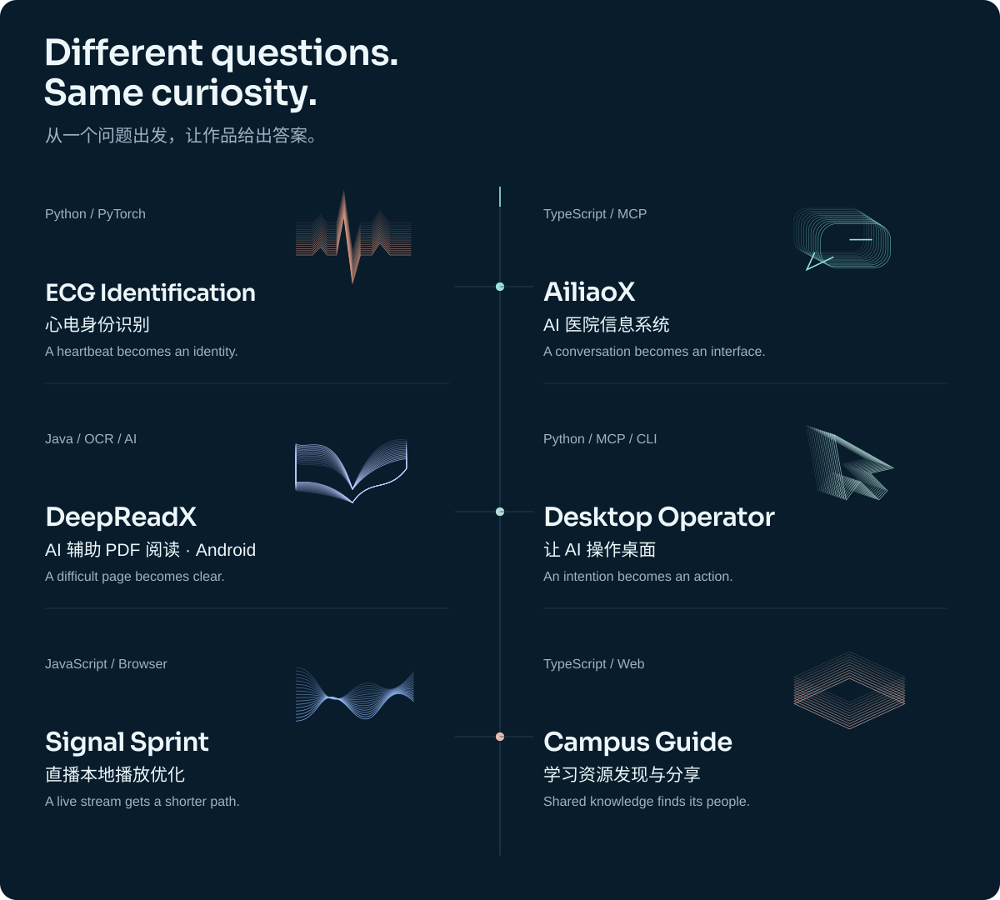
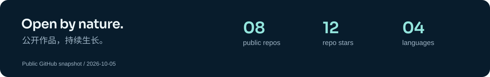
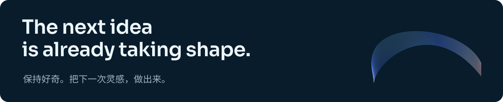

<picture>
  <source media="(prefers-reduced-motion: reduce) and (max-width: 640px)" srcset="./assets/shape/hero-mobile-still.svg" />
  <source media="(prefers-reduced-motion: reduce)" srcset="./assets/shape/hero-still.svg" />
  <source media="(max-width: 640px)" srcset="./assets/shape/hero-mobile.svg" />
  
</picture>

  <a href="#作品地图">作品地图</a> &nbsp; / &nbsp;
  <a href="https://github.com/Marways7?tab=repositories">全部仓库</a> &nbsp; / &nbsp;
  <a href="https://space.bilibili.com/604578545">B站 · AI创意屋</a> &nbsp; / &nbsp;
  <a href="./docs/STATIC.md">静态阅读</a>

 

### 你好，我是 Marways。

我喜欢把「能不能这样做？」变成一个可以打开、运行、体验的东西。

从心电信号里的身份特征，到能读懂一页 PDF 的 AI；从自然语言驱动的信息系统，到让 AI 真正操作桌面的工具——我在探索 **AI 与现实之间，具体能发生什么**。

**想法可以跳跃，作品要落地。** 这里记录我的实验、学习和开源作品，也欢迎你一起把它们做得更好。

I build with AI, follow unusual questions, and turn experiments into things people can try.

 

## 作品地图

<picture>
  <source media="(prefers-reduced-motion: reduce) and (max-width: 640px)" srcset="./assets/shape/projects-mobile-still.svg" />
  <source media="(prefers-reduced-motion: reduce)" srcset="./assets/shape/projects-still.svg" />
  <source media="(max-width: 640px)" srcset="./assets/shape/projects-mobile.svg" />
  
</picture>

| 如果你对这些感兴趣 | 从这里开始 |
| :--- | :--- |
| 心电信号与深度学习 | **[ECG Identification](https://github.com/Marways7/ECG_IdentificationX)** — 从信号处理到轻量 CNN 的心电身份识别实验 |
| 自然语言与信息系统 | **[AiliaoX](https://github.com/Marways7/AiliaoX)** — 通过 MCP 连接 AI 与医院信息管理 |
| AI 与阅读理解 | **[DeepReadX](https://github.com/Marways7/DeepReadX)** — Android PDF 阅读、OCR 与可自定义风格的 AI 讲解 |
| AI 与桌面操作 | **[MCP 版](https://github.com/Marways7/cua_desktop_operator_skill)** / **[CLI 版](https://github.com/Marways7/cua_desktop_operator_cli_skill)** — 面向 AI Agent 的桌面操作工具 |
| 浏览器与播放体验 | **[Signal Sprint](https://github.com/Marways7/signal-sprint)** — 直播本地播放优化与测量 |
| 校园与知识分享 | **[Campus Guide](https://github.com/Marways7/college_student_self-rescue_guide_website)** — 学习资源的发现、管理与分享 |

<b>我用什么，把想法做出来</b>

 

| 探索方向 | 作品中用到的工具 |
| :--- | :--- |
| 信号与模型 | Python、PyTorch、信号处理 |
| 产品与界面 | TypeScript、JavaScript、Web、Java、Android |
| AI 与行动 | MCP、AI 服务集成、桌面自动化 |

这些是作品中的技术选择，而不是熟练度评分。项目能力、运行条件与当前状态，以各仓库说明为准。

 

<picture>
  <source media="(max-width: 640px)" srcset="./assets/shape/pulse-mobile.svg" />
  
</picture>

数据来自公开仓库，每日刷新。仓库 Star 为各公开仓库获得的 Star 之和；语言为各仓库主要语言的去重计数。

 

### 让好奇心继续传递。

在 **[B站 · Marways的AI创意屋](https://space.bilibili.com/604578545)** 看创意与实践；在 **[GitHub](https://github.com/Marways7?tab=repositories)** 看代码与过程。遇到问题或有新想法，欢迎到相应项目交流。

 

<picture>
  <source media="(max-width: 640px)" srcset="./assets/shape/footer-mobile.svg" />
  
</picture>

<!-- Original, repository-owned SVG artwork. Design and build notes: docs/DESIGN.md. -->
