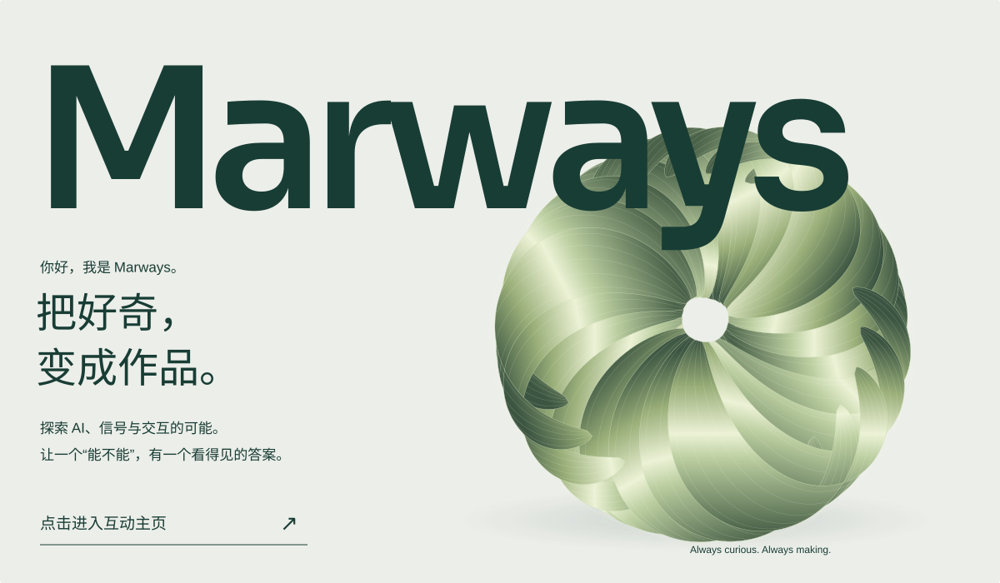
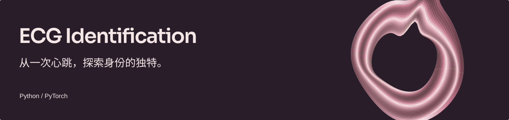
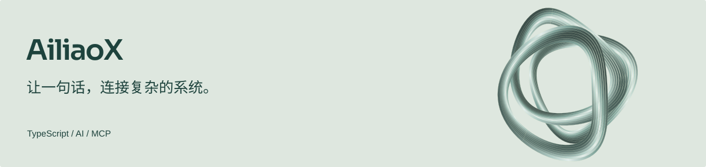
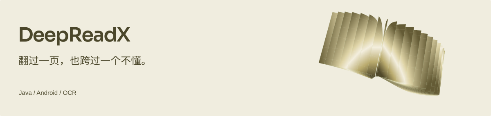
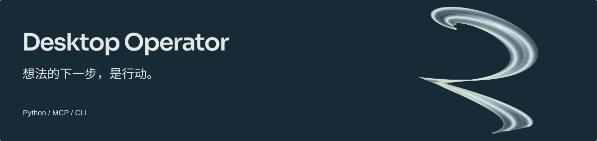
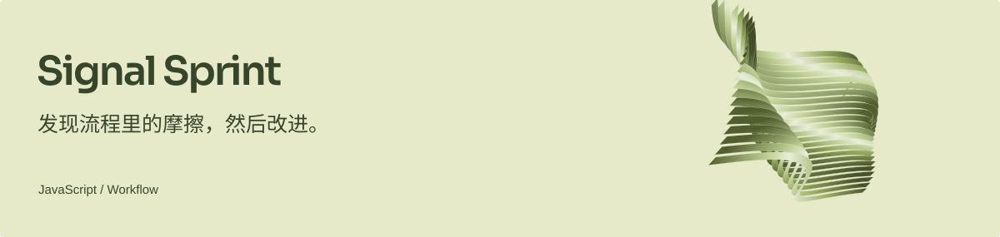
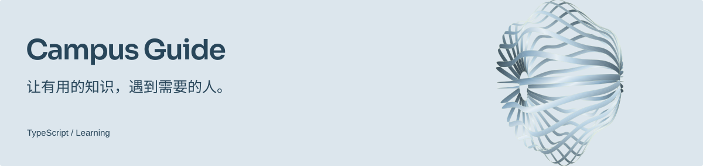

<a href="https://marways7.github.io/Marways7/">
  <picture>
    <source media="(prefers-reduced-motion: reduce) and (max-width: 640px)" srcset="./assets/shape/living-hero-mobile-still.svg" />
    <source media="(prefers-reduced-motion: reduce)" srcset="./assets/shape/living-hero-still.svg" />
    <source media="(max-width: 640px)" srcset="./assets/shape/living-hero-mobile.svg" />
    
  </picture>
</a>

  <b><a href="https://marways7.github.io/Marways7/">进入互动主页 ↗</a></b> &nbsp; / &nbsp;
  <a href="#作品">开源作品</a> &nbsp; / &nbsp;
  <a href="https://space.bilibili.com/604578545">B站 · AI 创意屋</a> &nbsp; / &nbsp;
  <a href="./docs/STATIC.md">静态阅读</a>

滚动穿过六个作品场景，拖动改变视角。也可以从作品索引直接出发。

 

### 你好，我是 Marways。

我用 AI 写代码，也用代码探索 AI。喜欢把具体的问题拆开，把零散的灵感接上，做出能够被尝试、被改进的东西。

从心电信号中的身份特征，到一页 PDF 的理解；从 AI 对话，到桌面上的行动。我在探索 **技术怎样成为真正用得上的工具**。

这里记录我的开源实验，也留着下一个“能不能”的位置。

 

## 作品

<a href="https://github.com/Marways7/ECG_IdentificationX">
  <picture>
    <source media="(max-width: 640px)" srcset="./assets/shape/living-project-1-mobile.svg" />
    
  </picture>
</a>

<a href="https://github.com/Marways7/AiliaoX">
  <picture>
    <source media="(max-width: 640px)" srcset="./assets/shape/living-project-2-mobile.svg" />
    
  </picture>
</a>

<a href="https://github.com/Marways7/DeepReadX">
  <picture>
    <source media="(max-width: 640px)" srcset="./assets/shape/living-project-3-mobile.svg" />
    
  </picture>
</a>

<a href="https://github.com/Marways7/cua_desktop_operator_skill">
  <picture>
    <source media="(max-width: 640px)" srcset="./assets/shape/living-project-4-mobile.svg" />
    
  </picture>
</a>

<a href="https://github.com/Marways7/signal-sprint">
  <picture>
    <source media="(max-width: 640px)" srcset="./assets/shape/living-project-5-mobile.svg" />
    
  </picture>
</a>

<a href="https://github.com/Marways7/college_student_self-rescue_guide_website">
  <picture>
    <source media="(max-width: 640px)" srcset="./assets/shape/living-project-6-mobile.svg" />
    
  </picture>
</a>

<a href="https://github.com/Marways7/cua_desktop_operator_cli_skill">Desktop Operator · CLI 版</a> &nbsp; / &nbsp; <a href="https://github.com/Marways7?tab=repositories">全部仓库 ↗</a>

<b>用几句话，了解这些项目</b>

| 作品 | 探索的方向 |
| :--- | :--- |
| [ECG Identification](https://github.com/Marways7/ECG_IdentificationX) | 心电生物特征身份识别，结合信号处理与轻量 CNN。 |
| [AiliaoX](https://github.com/Marways7/AiliaoX) | 通过 AI 对话与 MCP 工具，探索医院信息交互。 |
| [DeepReadX](https://github.com/Marways7/DeepReadX) | Android PDF 阅读、OCR 与可自定义风格的 AI 解释。 |
| [Desktop Operator](https://github.com/Marways7/cua_desktop_operator_skill) | 面向 AI 的桌面操作工具，提供 MCP 与 CLI 两种入口。 |
| [Signal Sprint](https://github.com/Marways7/signal-sprint) | 围绕直播准备流程，结合实测与本地回放改进操作节奏。 |
| [Campus Guide](https://github.com/Marways7/college_student_self-rescue_guide_website) | 大学生学习资源的发现、管理与分享。 |

具体功能、运行条件与当前进展，请查看各项目说明。

<b>我用什么把想法做出来</b>

| 方向 | 项目中使用的工具 |
| :--- | :--- |
| 信号与模型 | Python、PyTorch、信号处理 |
| 产品与界面 | TypeScript、JavaScript、Web、Java、Android |
| AI 与行动 | MCP、AI 服务集成、桌面工具 |

<b>公开 GitHub 数据快照</b>

<picture>
  <source media="(max-width: 640px)" srcset="./assets/shape/pulse-mobile.svg" />
  
</picture>

每日刷新。Star 为公开原创仓库获得的 Star 总和；语言为这些仓库主要语言的去重计数。

 

### 还在探索。还会继续。

在 **[互动主页](https://marways7.github.io/Marways7/)** 看作品之间的连接，在 **[B站 · Marways的AI创意屋](https://space.bilibili.com/604578545)** 看创意实验，在 **[GitHub](https://github.com/Marways7?tab=repositories)** 看代码与过程。

欢迎交流，一起把下一个问题，变成一个新的开始。

<!-- Repository-owned illustrations. Interactive website: site/. Design: docs/LIVING-ATLAS.md. -->
