# Marways — 把好奇，变成作品。

<picture>
  <source media="(max-width: 640px)" srcset="../assets/shape/living-hero-mobile-still.svg" />
  
</picture>

你好，我是 Marways。我用 AI 写代码，也用代码探索 AI。喜欢把问题拆开，把灵感接上，做出能够被尝试、被改进的东西。

| 作品 | 探索的方向 |
| :--- | :--- |
| [ECG Identification](https://github.com/Marways7/ECG_IdentificationX) | 心电生物特征身份识别，结合信号处理与轻量 CNN。 |
| [AiliaoX](https://github.com/Marways7/AiliaoX) | 通过 AI 对话与 MCP 工具，探索医院信息交互。 |
| [DeepReadX](https://github.com/Marways7/DeepReadX) | Android PDF 阅读、OCR 与可自定义风格的 AI 解释。 |
| [Desktop Operator](https://github.com/Marways7/cua_desktop_operator_skill) | 面向 AI 的桌面操作工具，提供 MCP 与 CLI 两种入口。 |
| [Signal Sprint](https://github.com/Marways7/signal-sprint) | 围绕直播准备流程，结合实测与本地回放改进操作节奏。 |
| [Campus Guide](https://github.com/Marways7/college_student_self-rescue_guide_website) | 大学生学习资源的发现、管理与分享。 |

[Desktop Operator CLI 版](https://github.com/Marways7/cua_desktop_operator_cli_skill) · [全部仓库](https://github.com/Marways7?tab=repositories) · [B站 · AI 创意屋](https://space.bilibili.com/604578545) · [返回介绍页](../README.md)
