# Marways · Ideas take shape

<picture>
  <source media="(max-width: 640px)" srcset="../assets/shape/hero-mobile-still.svg" />
  
</picture>

我喜欢把「能不能这样做？」变成一个可以打开、运行、体验的东西。

| 作品 | 探索方向 |
| :--- | :--- |
| [ECG Identification](https://github.com/Marways7/ECG_IdentificationX) | 心电身份识别与深度学习 |
| [AiliaoX](https://github.com/Marways7/AiliaoX) | AI 与医院信息管理 |
| [DeepReadX](https://github.com/Marways7/DeepReadX) | Android PDF 阅读、OCR 与 AI 讲解 |
| [Desktop Operator · MCP](https://github.com/Marways7/cua_desktop_operator_skill) / [CLI](https://github.com/Marways7/cua_desktop_operator_cli_skill) | 让 AI 操作桌面 |
| [Signal Sprint](https://github.com/Marways7/signal-sprint) | 直播本地播放优化与测量 |
| [Campus Guide](https://github.com/Marways7/college_student_self-rescue_guide_website) | 学习资源发现、管理与分享 |

**想法可以跳跃，作品要落地。**

[全部仓库](https://github.com/Marways7?tab=repositories) · [B站 · Marways的AI创意屋](https://space.bilibili.com/604578545) · [返回主页](../README.md)
